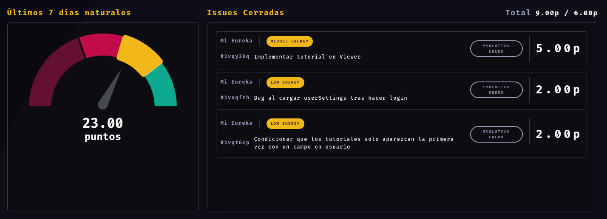
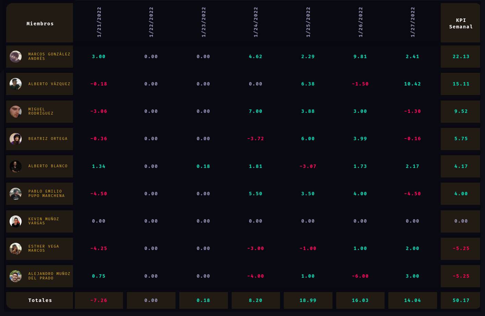

<!-- markdownlint-disable MD041 -->
<!-- markdownlint-disable MD033 -->
[Volver](../index.md)

# Bi-Productive

Documentación del proyecto Bi-Productive, principalmente de la plataforma web y de la lógica asociada al micro-servicio que genera la información que en ella se muestra.

Realizada sobre la v1.6.5.

## Acceso

Para acceder a la plataforma será necesario autenticarse a través de GitHub.

## Secciones

### Daily

En esta sección tendremos acceso al resumen diario de cada miembro del equipo. Es la sección que veremos por defecto si accedemos a la plataforma sin indicar ninguna URL específica. Si lo hacemos, iremos directos a la daily con nuestro usuario seleccionado y del día anterior. Este último punto está sujeto a cambios, dado que entendemos que a partir de cierta hora puede ser más útil visualizar ya el mismo día en el que estamos y así poder monitorizar nuestro progreso durante el propio día.

Aquí se recogerán dos tipos de tarea:

- Tareas con puntos estimados y disponibles en la misión que han sido cerradas durante ese día.
- Tareas no cerradas y sin tiempo estimado pero con los tags que indican que son tareas que deben siempre registrar como productivo el tiempo imputado.

Los conceptos a tener cuenta son:

> Qué entendemos por un día?

Cuando hablamos de día, hablamos del tiempo transcurrido entre las 8:15 de ese día y las 8:15 del día siguiente. Hora española.

> Qué condiciones deben cumplir las tareas para ser computadas?

En general, cualquiera tarea, para ser computada por el micro-servicio debe tener:

- Misión establecida.
- Debe ser facturable.

Si además está estimada y cerrada, será procesada el día que se cierre y computado el tiempo estimado si la misión tiene tiempo disponible.
La otra opción para ser procesada es que tenga tags que hagan que se compute el tiempo imputado (sin estimación ni *energy*).

> Qué entendemos por tarea cerrada?

Para considerar una tarea como cerrada deberá haber pasado al status **Done** durante ese día. Este cambio ha de ser manual a través de ClickUp. Si bien existe la opción de cerrar la tarea a través de un commit de GitHub, a día de hoy ClickUp no establece la propiedad *DATE CLOSED* cuando lo hacemos así, por lo que no podemos identificar cuándo fue cerrada la task y por lo tanto no computará. Supuestamente están trabajando en este punto para que podamos usar esta modalidad.

> Qué entendemos por misión establecida?

Para considerar que una misión tiene misión establecida debe tener establecido un *custom field* en ClickUp que se llame `Misión` o `Mision` (*case insensitive*).

> Qué entendemos por facturable?

Para considerar una tarea como facturable simplemente no debe tener el tag `non-billable`.

> Qué entendemos por puntos estimados?

Se trata del valor que establecemos en la propiedad `TIME ESTIMATE` de ClickUp. Si bien el nombre hace referencia a horas, nuestro concepto son los puntos.

> Qué entendemos por puntos disponibles en la misión?

Los puntos que contarán como productivos y que por lo tanto se sumarán al reporte diario serán los puntos que estén dentro de los disponibles de la misión asociada a la tarea. Una vez se alcance el máximo de puntos de la misión, los puntos no contarán como productivos. Este apartado estará explicado en profundidad en el apartado de [Proyectos](#proyectos).

> Qué tareas no estimadas ni cerradas son válidas para computar el tiempo imputado?

Consideramos válidas las tareas que cumplan lo siguiente:

- Deben tener uno de los siguientes tags (*case insensitive*):
  - Management
  - Meeting
  - Systems
  - Sistemas
- No debe tener el tag `Custom Energy` (*case insensitive*).
- No debe estar estimada, es decir, no debe tener valor en la propiedad `TIME ESTIMATE`.

---

El interfaz de la sección cuenta con dos apartados principales

#### Últimos días

Actualmente se muestra a modo de resumen el rendimiento de los últimos 7 días naturales. El funcionamiento es simple: se obtienen estos últimos 7 días (los justamente previos al día que visualizamos), se calcula el total de puntos que se esperan del perfil y se suman los puntos productivos.

> Cómo funcionan los colores y qué significan?

Los colores responden a los siguientes baremos:

- Rojo oscuro: se han conseguido menos del 50% de los puntos esperados.
- Rojo: se han conseguido al menos un 50% de los puntos esperados pero menos del 75%.
- Amarillo: se han conseguido al menos un 75% de los puntos esperados pero menos del 100%.
- Verde: se han conseguido al menos el 100% de los puntos esperados.

NOTA: la zona verde puede crecer. Al no haber límite, si venimos realizando unos días muy productivos, nuestra zona verde podrá crecer (no hasta el infinito, pero sí hasta cierto punto)

Los puntos que se esperan de cada miembro vienen determinados por su ratio de productividad multiplicado por las horas laborables del día. De esta forma, no se espera lo mismo de todos los perfiles, como bien sabéis, y tampoco se espera lo mismo un viernes que el resto de la semana. Igualmente, durante el horario de verano, las horas esperadas se ajustan al horario reducido.

#### Issues cerradas

En este apartado veremos un listado de las tareas que se han computado para el día que estamos viendo. Estas tareas serán las que cumplan los requisitos detallados previamente.

Para cada tarea veremos el nombre, el espacio ClickUp al que corresponden, tendremos un enlace directo a la tarea en ClickUp y un tag que muestre la estimación.

Por último, veremos los puntos productivos que cada tarea ha sumado ese día. A tener en cuenta: estos puntos podrán no corresponderse con la estimación si la misión ya no dispone de puntos suficientes. De nuevo, esto quedará más detallado en el apartado de [Proyectos](#proyectos).

---

En la sección de Daily podremos navegar entre los miembros del equipo y los días con los controles del header de la página. Para mayor comodidad, se puede usar el teclado para una navegación más rápida:

- Con las flechas arriba y abajo, navegaremos entre los miembros del equipo, sin cambiar el día.
- Con las flechas izquierda y derecha, navegaremos entre los días del calendario, sin cambiar el miembro del equipo.

### Ranking

En esta sección tendremos de manera rápida y resumida una visión global del rendimiento del equipo durante la semana.

> Qué entendemos por semana?

Consideramos que las semanas van desde el viernes hasta el jueves, ambos incluidos.

> Qué días muestra el ranking por defecto?

Esta parte está sujeta a cambios. Actualmente, el viernes, día en el que usamos el ranking para nuestra Weekly, se muestran los días que comprenden la semana justamente anterior. Esta vista se mantiene así durante el fin de semana y el lunes ya se muestra la nueva semana (desde el viernes hasta el día anterior). Es probable que esto cambie. Con el uso seguramente veamos qué es lo más útil en cada caso.

La tabla es bastante auto-explicativa, pero vamos a repasar brevemente los conceptos:

#### Miembros

Aparecerán todos los miembros del equipo que ya estén computando en el micro-servicio. A tener en cuenta que los miembros de administración no aparecerán y las nuevas incorporaciones seguramente tampoco aparezcan durante sus primeras semanas de trabajo.

Los miembros aparecerán ordenados por el KPI Semanal. Kudos para el primero!

#### Días

Aparecerán indicados los días que se están teniendo en cuenta para los totales de los miembros y el total global. Para cada miembro y cada día, veremos el balance de puntos esperados contra puntos productivos.

#### KPI Semanal

Este es el baremo que lo resume todo. No es más que una suma del balance de cada día entre los puntos esperados y los puntos productivos conseguidos por cada miembro en los días que muestra la tabla.

#### Totales

Tenemos igualmente el total que ha conseguido el equipo cada día y finalmente el total global del equipo durante la semana.

---

A mayores, es interesante comentar ciertos puntos:

- Cada día que se muestra en la tabla es un enlace que nos llevará a la sección de daily y nos mostrará los datos de ese miembro del equipo para ese día en concreto. Si algo nos llama la atención o queremos revisarlo, podemos acceder directamente a ese día de esta forma.
- Contamos con un sencillo código de colores:
  - Rojo: el balance es negativo.
  - Gris: el balance es 0. Normalmente serán días no laborables (vacaciones, fines de semana, bajas, etc) o en algunos casos simplemente vendrá a decir que hemos conseguido exactamente tantos puntos productivos como los que se esperaban.
  - Verde: el balance es positivo.

Finalmente, en esta sección también disponemos de controles que nos permiten consultar estos datos para cualquier periodo de tiempo. En el header podemos establecer las fechas *desde* y *hasta* y la tabla nos mostrará la información requerida.

Toda la explicación ha sido basada en el ranking semanal, pues será su uso más común, pero podremos analizar cualquier periodo que nos interese.

### Proyectos

Esta sección será únicamente visible para usuarios que cumplan alguna de estas condiciones:

- Sean miembros de Dirección.
- Sean jefes de proyecto de al menos un proyecto.

Aquí se mostrará una lista de todos los proyectos dados de alta en nuestro gestor. No se podrán dar de alta desde aquí. Se encargarán de ello principalmente Isabel y Cristian.

Los miembros de Dirección verán todos los proyectos existentes y el resto de miembros del equipo con acceso a esta sección verán simplemente los proyectos que dirigen.

#### Detalles de un proyecto

Cuando accedamos a uno de los proyectos del listado, podremos ver los detalles.

> NOTA: incluiremos una captura del interfaz tan pronto tengamos algún proyecto que muestre datos relevantes para explicar los conceptos que explicaremos a continuación.

En esta ficha, tendremos tres apartados principales.

##### Gauge de puntos

En este gauge podremos ver de un vistazo el estado del proyecto en cuanto a puntos se refiere. Vendrán indicados:

- Puntos consumidos: puntos productivos de tareas asociadas a cualquiera de las misiones de este proyecto que ya han sido computadas. No confundir con puntos repartidos o asignados, un concepto que veremos a continuación.
- Puntos totales: son los puntos totales disponibles para el proyecto. También se indican en la parte superior, puesto que es el dato principal a tener en cuenta y que determina el margen dentro del que deberemos trabajar para completar el proyecto.
- Puntos restantes: será la resta entre los dos conceptos previos, es decir, la cantidad de puntos que aún no hemos consumido.

El gauge nos indicará visualmente *la salud* del proyecto:

- Zona verde: se han consumido un 65% de los puntos totales o menos.
- Zona amarilla: se han consumido más del 65% pero menos del 85% de los puntos totales.
- Zona roja: se han consumido más del 85% pero menos del 95% de los puntos totales.
- Zona roja oscura: se han consumido más del 95% de los puntos totales. Danger!

Al tratarse de puntos productivos, limitados por las misiones, que a su vez están limitadas por los puntos totales, nunca nos pasaremos del 100%. Si llegamos al 100% y necesitamos seguir usando puntos, estos no contarán como productivos.

##### Ficha técnica

Aquí veremos un resumen de los datos básicos del proyecto:

- Cliente asociado al proyecto.
- Espacio(s) ClickUp: listado de enlaces directos a los espacios de ClickUp asociados al proyecto.
- Fecha de inicio: fecha en la que el proyecto deberá dar inicio.
- Fecha de entrega: fecha en la que el proyecto debería estar terminado y entregado al cliente.
- Fecha de fin de garantía: fecha en la que terminará la garantía del proyecto.
- Fecha de liquidación: fecha en la que se liquidará el proyecto.

##### Gestión de misiones

Este es sin duda el apartado principal de la ficha de proyecto.

A modo de resumen, veremos dos datos:

- Puntos repartidos: suma de puntos disponibles de las misiones ya creadas (las que aparecerán en el listado).
- Puntos disponibles: cantidad de puntos que aún están disponibles para asignar a misiones (ya sea creando nuevas o aumentando los puntos disponibles de alguna existente).

Y posteriormente veremos el listado de las misiones, incluyendo:

- Nombre de la misión
- Puntos (consumidos / total disponibles). Es decir, si la misión dispone de 10 puntos y ya se han cerrado tareas que han consumido 6 puntos, veremos un **6 / 10**.
- Acciones
  - Editar: podremos editar el nombre y los puntos disponibles para la misión.
  - Eliminar: sólo aparecerá para misiones que aún no tengan puntos consumidos. Una vez se cierre una tarea asociada a la misión que compute puntos, no se podrá eliminar.

Por último, tendremos un botón para añadir una nueva misión. No podremos guardar la nueva misión si no hemos establecido un nombre y hemos asignado puntos.

---

Una vez detallada la información disponible en el interfaz, vamos a explicar el funcionamiento de las misiones.

Esta es la parte más importante de la plataforma a día de hoy. El flujo viene determinado por el modelo de datos basado en proyectos y su relación con el de ClickUp, basado en espacios y carpetas/listas.

Existen dos grandes vertientes a la hora de crear una misión:

> La misión no existe en ClickUp

Será el escenario más común y repetido para proyectos nuevos.

En este caso, la misión aparecerá en ROJO. Esto nos indicará que no existe en ClickUp, que no ha sido *sincronizada*. Para cambiar este estado, deberemos crearla a mano en ClickUp.

**IMPORTANTE**: la misión deberá llamarse exactamente igual en ClickUp

Una vez esté creada en ClickUp seguirá apareciendo en ROJO. No aparecerá como sincronizada hasta que se haya cerrado una tarea asociada a la misión y el micro-servicio la compute. Cuando esto suceda, la misión aparecerá en amarillo BinPar.

> La misión existe en ClickUp

Será el escenario más común para proyectos en los que ya se está trabajando.

Lo principal a tener en cuenta es que debemos llamar a la misión exactamente igual que como se llama en ClickUp, en este caso concreto respetando también mayúsculas. Es vital cumplir con este punto.

Si lo hacemos de forma correcta, la misión aparecerá ya en amarillo BinPar, indicando que se ha encontrado la misión de ClickUp y ambas se han asociado.

> Por qué el proceso de sincronización no es más automático o más cómodo?

A día de hoy sin duda este punto es el más incómodo de la herramienta, si bien no nos es posible mejorarlo por limitaciones de ClickUp. Básicamente las misiones en ClickUp no son un campo genérico sino, como sabéis, un *custom field*. Si bien ClickUp permite consultar estos campos y podemos acceder a su información cuando el micro-servicio computa cada tarea, no disponemos de la opción de gestionarlos. Es decir, no podemos añadir una nueva opción al campo *Misión* a través de su API. Les hemos trasladado la importancia que tendría para nosotros poder hacer esto y si bien está en su hoja de ruta y hace ya más de dos años que es una de las peticiones más populares, ahora mismo nos han comunicado que están centrados en otros puntos como el rendimiento y la estabilidad de la plataforma. Esperemos que pronto apuntalen todo bien y puedan dedicarse a nuevas funcionalidades como esta que haría nuestra vida mucho más sencilla.

> Entonces, cómo funciona la detección de la misión existente en ClickUp?

En resumen: funciona tan bien como nos es posible. Pero a día de hoy es importante saber que no es perfecto.

Como decía, es importante nombrar la tarea al crearla exactamente igual que la de ClickUp porque el match se hace por nombre.

El otro punto vital es que el proyecto tenga asociados los espacios de ClickUp correctos, pues buscaremos la misión entre estos espacios. Si vemos que a nuestro proyecto le falta algún espacio asociado, no dejéis de avisarnos para que lo añadamos.

Partiendo del supuesto en el que todo esto es correcto, lo que hace el sistema es obtener todas las misiones asociadas a las tareas asociadas a los espacios ClickUp relacionados con el proyecto (de ahí su importancia) y una vez obtenido el listado se busca alguna cuyo nombre coincida (de ahí su importancia).

Esto funcionará la gran mayoría de veces, pero podrá ser problemático para proyectos asociados con varios espacios en los que puedan existir misiones con el mismo nombre (como *Diseño*, *Gestión*, etc).

Os pedimos que si creéis que este escenario podría darse y generar algún problema, nos aviséis para que revisemos que la sincronización ha sido correcta.

> Cuántos puntos puedo asignar a una nueva misión?

Puedes asignar tantos puntos como quieras siempre que la suma de puntos asignados de las misiones no sobrepasen el total disponible para el proyecto.

> Puedo modificar los puntos de una misión ya existente?

Sí, con la misma limitación comentada en el punto previo.

> Puedo eliminar una misión?

Sí, siempre y cuando no se haya consumido ningún punto en ninguna tarea asociada. Una vez la misión tenga puntos consumidos, directamente el botón de *Eliminar* no aparecerá.

> Cómo se determina los puntos reportados que se computan como puntos productivos en cada tarea?

Este es sin duda el cambio principal que aporta este sistema. Hasta ahora, sin misiones gestionadas en Bi-Productive, todos los puntos reportados se contaban como productivos.

Los puntos reportados vienen determinados por las siguientes vías:

- La tarea está estimada a través del campo `TIME ESTIMATE`.
- La tarea tiene un *custom field* denominado `Custom Energy` (*case insensitive*), en cuyo caso los valores serán:
  - Zero Energy: 0.5 puntos
  - Low Energy: 2 puntos
  - Middle Energy: 5 puntos
  - High Energy: 8 puntos
- La tarea cumple todos los requisitos para computar como puntos el tiempo reportado (explicado previamente en la sección [Daily](#daily)). Hablamos de las típicas tareas de gestión, reuniones, etc.

Una vez obtenemos estos puntos, quedarán guardados como "puntos totales" de la tarea. Como decía, hasta disponer de la gestión de misiones, este valor era igualmente asignado a los puntos productivos de la misma.

A partir de ahora, los puntos productivos serán tantos puntos reportados como tenga disponible la misión asociada. Es decir, si mi tarea tiene estimada 4 puntos, pero la misión asociada tenía 20 puntos y ya he consumido 18 con otras tareas, el tiempo total será 4 pero el productivo será 2. Por supuesto, cualquier tarea computada en la misma misión posteriormente tendrá 0 puntos productivos.

> Qué sucede si la misión de mi tarea no tiene ya los suficientes puntos disponibles pero el jefe de proyecto decide darme más puntos?

No hay problema, en la siguiente ejecución del micro-servicio se ajustará y se contarán tantos puntos productivos como determinen los nuevos puntos disponibles de la misión.

---

Es interesante comentar que guardamos todo el historial de cambios que sufren las misiones, por lo que podremos revisar cualquier problema que se os presente.

### Misiones

Esta sección simplemente es un apartado con la principal intención de ayudar a comprobar rápidamente si la misión en la que estamos trabajando está ya sincronizada con ClickUp.

Siguiendo la lógica detallada en la sección [Proyectos](#proyectos), se mostrarán en ROJO las misiones pendientes de sincronización.

Por la naturaleza del flujo, es importante saber que puede aparecer en ROJO pero que la misión ya haya sido creada en ClickUp. Será así hasta que el micro-servicio procese al menos una tarea computable asociada a dicha misión.

Estamos estudiando alguna forma sencilla de evitar confusiones al respecto. Lo más probable es que habilitemos para miembros de Dirección y jefes de proyecto, la opción de marcar al menos como "ya creada" una misión y poder saber así que, aunque no está sincronizada, sí ha sido creada ya en ClickUp.

### Documentación

Esta sección de reciente creación nos permite generar documentación en vivo, es decir, sin necesidad de realizar despliegues.

Para ello hemos enlazado con un repositorio público llamado `binpar-docs` donde podremos documentar cualquier cosa que necesitemos. La documentación de este proyecto es un ejemplo en sí.

No es necesario entrar en detalle puesto que en la página principal de esta sección aparecen los puntos clave a tener en cuenta para usar correctamente este desarrollo y en ese mismo lugar iremos añadiendo igualmente cualquier nuevo punto a tener en cuenta.

Si estás interesado en añadir la documentación o realizar un post-mortem de tu proyecto, pídenos acceso al repositorio (es público pero para editar necesitarás que te demos acceso).

## Presentación

Por último, compartimos aquí el vídeo de la presentación del proyecto al equipo de BinPar:

<video controls title="Presentación Bi-Productive">
  <source src="https://binpar.s3.eu-west-1.amazonaws.com/presentations/bi-productive.mkv">
</video>
