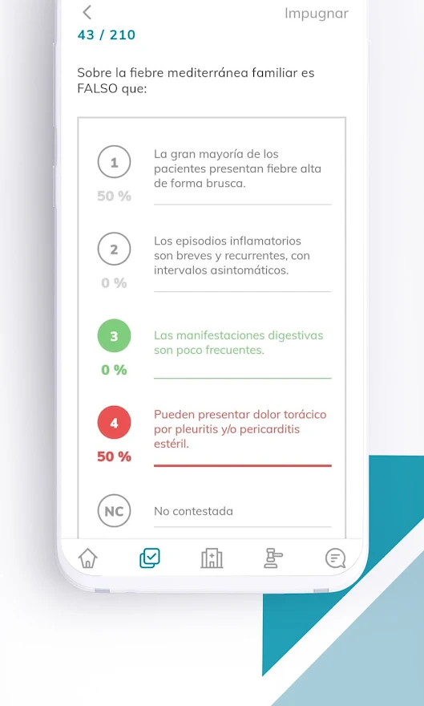

# PostMIR 2022

## Descripción del Proyecto

Dentro del alcance de la edición 2022 del proyecto de PostMIR el objetivo clave era actualizar la aplicación
y estabilizarla. Además hacer algunos cambios e informes adicionales.

Los retos incluían asumir un proyecto sin documentación, desactualizado y con una gran inestabilidad
y convertirlo en un proyecto actualizado y depurado.

Adición de capturas de pantalla del mismo.

Android: https://play.google.com/store/apps/details?id=com.binpar.postmir&hl=en&gl=US

iOS: https://apps.apple.com/es/app/postmir/id1339550309

## Resultados

- Nº de usuarios participantes: 2703

Este año parece no haber habido problemas de registro con el DNI o NIE, siendo esta una mejora importante.
Además, tampoco se registraron problemas mayores en todo el proceso. La mejora sobre las actualizaciones
de las puntuaciones y el re-cálculo de las notas funcionó a la perfección después de una pequeña
corrección.

Se realizó un rework completo del sistema de rutas y con la revisión completa de la app parece que
se mejoró bastante la velocidad de la aplicación y su rendimiento.

También se realizaron cambios en la forma que se procesaban los inputs de la plantilla del examen que
rellenan los usuarios para mejorar bastante la velocidad de esta parte.

## Aprendizaje

El mayor aprendizaje de este proyecto que se puede extraer es que merece la pena mantener actualizadas
las versiones de las librerías y dedicarle tiempo a la revisión del proyecto, en especial, si el
proyecto es heredado y tiene antecedentes de problemas en versiones anteriores.

Requiere bastante esfuerzo revisar un proyecto que no conoces pero también es la mejor forma de conocerlo.

## Problemas Detectados

El problema más destacado fue uno que hacía que no se calculasen correctamente las netas después de una
actualización de las preguntas causado por el rework que se hizo de la parte de cálculo de notas.
En cuanto lo reportaron, se revisó y se solucionó sin mayor problema.

## Posibles Mejoras

Para la versión del año que viene habrá que actualizar a la nueva versión de Expo y algunas librerías.

Además de esto se deberían actualizar las librerías de los tutoriales o cambiarlas por otras para
mejorar esa experiencia.

Los procedimientos, por el momento, no parecen necesitar una revisión.
